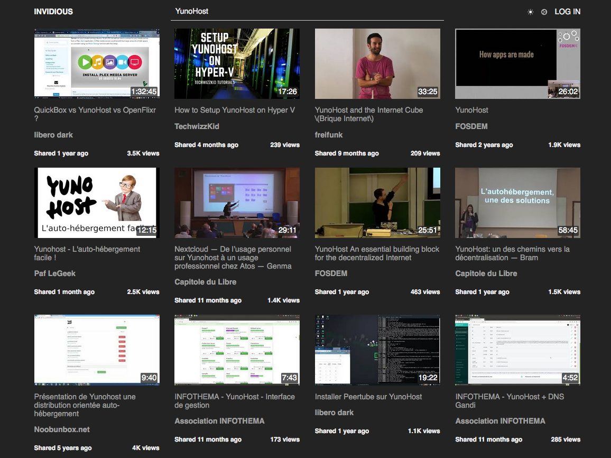

# Invidious pour YunoHost

[](https://dash.yunohost.org/appci/app/invidious)    
[](https://install-app.yunohost.org/?app=invidious)

*[Read this readme in english.](./README.md)* 

> *Ce package vous permet d'installer Invidious rapidement et simplement sur un serveur YunoHost.  
Si vous n'avez pas YunoHost, consultez [le guide](https://yunohost.org/#/install) pour apprendre comment l'installer.*

## Vue d'ensemble
Invidious est une interface alternative à YouTube.

**Version incluse :** 0.20.1

## Captures d'écran



## Démo

* [Démo officielle](https://invidious.site/)

## Configuration

## Documentation

 * Documentation officielle : https://github.com/iv-org/invidious/wiki
 * Documentation YunoHost : https://yunohost.org/#/app_invidious_fr

## Caractéristiques spécifiques YunoHost

#### Support multi-utilisateur

* L'authentification LDAP est-elle prise en charge ? **Non**
* L'application peut-elle être utilisée par plusieurs utilisateurs ? **Oui**

#### Architectures supportées

* x86-64 - [](https://ci-apps.yunohost.org/ci/apps/invidious/)
* ARMv8-A - [](https://ci-apps-arm.yunohost.org/ci/apps/invidious/)

## Liens

 * Signaler un bug : https://github.com/YunoHost-Apps/invidious_ynh/issues
 * Site de l'application : https://invidio.us/
 * Dépôt de l'application principale : https://github.com/iv-org/invidious
 * Site web YunoHost : https://yunohost.org/

---

## Informations pour les développeurs

Merci de faire vos pull request sur la [branche testing](https://github.com/YunoHost-Apps/invidious_ynh/tree/testing).

Pour essayer la branche testing, procédez comme suit.
```
sudo yunohost app install https://github.com/YunoHost-Apps/navidrome_ynh/tree/testing --debug
ou
sudo yunohost app upgrade invidious -u https://github.com/YunoHost-Apps/invidious_ynh/tree/testing --debug
```
