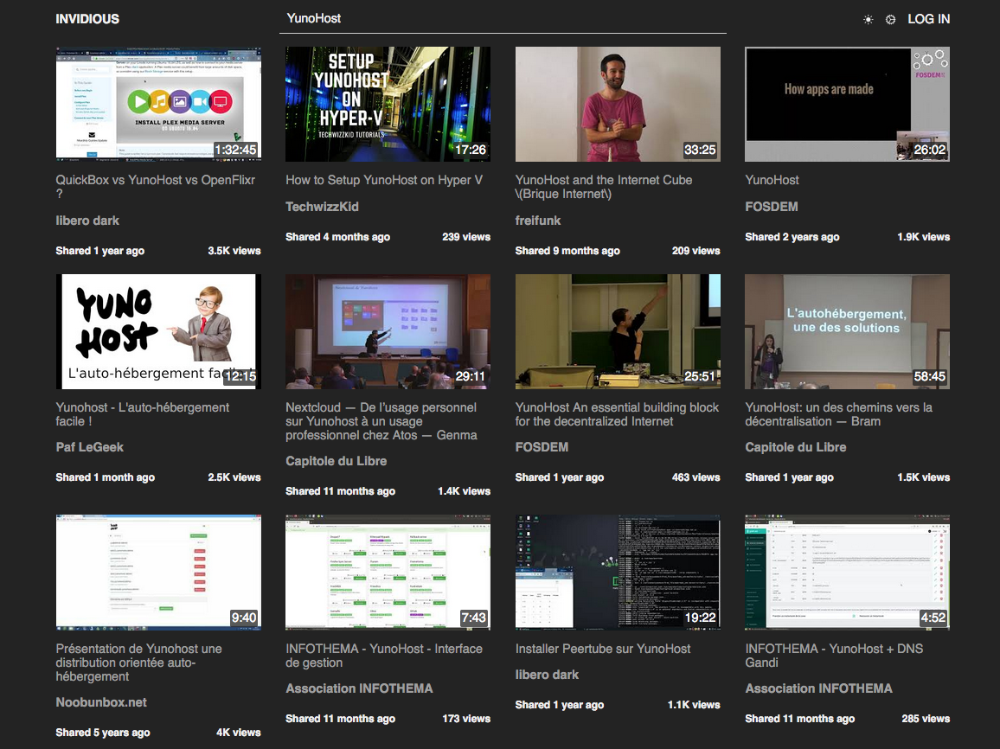

<!--
N.B.: This README was automatically generated by https://github.com/YunoHost/apps/tree/master/tools/README-generator
It shall NOT be edited by hand.
-->

# Invidious pour YunoHost

[](https://dash.yunohost.org/appci/app/invidious)  

[](https://install-app.yunohost.org/?app=invidious)

*[Read this readme in english.](./README.md)*

> *Ce package vous permet d’installer Invidious rapidement et simplement sur un serveur YunoHost.
Si vous n’avez pas YunoHost, regardez [ici](https://yunohost.org/#/install) pour savoir comment l’installer et en profiter.*

## Vue d’ensemble

Invidious est une interface permettant d'accéder aux vidéos Youtube sans passer par youtube.com
En plus de constituer un avantage sur le plan de la confidentialité (les données ne transitent pas directement par les services du géant).

### Fonctionnalités :

- Mode audio seul,
- Mode sombre,
- Possibilité d'afficher les commentaires Reddit plutôt que les commentaires YouTube,
- Possibilité de s'abonner aux chaines sans créer de compte Google

**Version incluse :** 24.01.18~ynh2

**Démo :** https://invidious.site/

## Captures d’écran



## :red_circle: Fonctions indésirables

- **Non-free Network Services**: Promotes or depends entirely on a non-free network service.

## Documentations et ressources

* Site officiel de l’app : <https://invidio.us/>
* Documentation officielle de l’admin : <https://docs.invidious.io/>
* Dépôt de code officiel de l’app : <https://github.com/iv-org/invidious>
* YunoHost Store: <https://apps.yunohost.org/app/invidious>
* Signaler un bug : <https://github.com/YunoHost-Apps/invidious_ynh/issues>

## Informations pour les développeurs

Merci de faire vos pull request sur la [branche testing](https://github.com/YunoHost-Apps/invidious_ynh/tree/testing).

Pour essayer la branche testing, procédez comme suit.

``` bash
sudo yunohost app install https://github.com/YunoHost-Apps/invidious_ynh/tree/testing --debug
ou
sudo yunohost app upgrade invidious -u https://github.com/YunoHost-Apps/invidious_ynh/tree/testing --debug
```

**Plus d’infos sur le packaging d’applications :** <https://yunohost.org/packaging_apps>