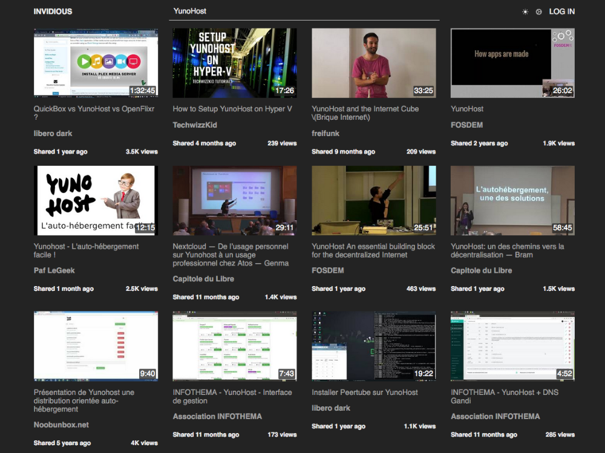

<!--
NOTA: Este README foi creado automáticamente por <https://github.com/YunoHost/apps/tree/master/tools/readme_generator>
NON debe editarse manualmente.
-->

# Invidious para YunoHost

[](https://dash.yunohost.org/appci/app/invidious)  

[](https://install-app.yunohost.org/?app=invidious)

*[Le este README en outros idiomas.](./ALL_README.md)*

> *Este paquete permíteche instalar Invidious de xeito rápido e doado nun servidor YunoHost.*  
> *Se non usas YunoHost, le a [documentación](https://yunohost.org/install) para saber como instalalo.*

## Vista xeral

Invidious is an interface allowing access to Youtube videos without going through youtube.com
In addition to constituting an advantage in terms of confidentiality (the data does not pass directly through the services of the giant).

### Features:

- Audio only mode,
- Dark mode,
- Ability to display Reddit comments instead of YouTube comments,
- Ability to subscribe to channels without creating a Google account 


**Versión proporcionada:** 24.02.12~ynh1

**Demo:** <https://invidious.site/>

## Capturas de pantalla



## :red_circle: Caraterísticas cuestionables

- **Non-free Network Services**: Promotes or depends entirely on a non-free network service.

## Documentación e recursos

- Web oficial da app: <https://invidio.us/>
- Documentación oficial para admin: <https://docs.invidious.io/>
- Repositorio de orixe do código: <https://github.com/iv-org/invidious>
- Tenda YunoHost: <https://apps.yunohost.org/app/invidious>
- Informar dun problema: <https://github.com/YunoHost-Apps/invidious_ynh/issues>

## Info de desenvolvemento

Envía a túa colaboración á [rama `testing`](https://github.com/YunoHost-Apps/invidious_ynh/tree/testing).

Para probar a rama `testing`, procede deste xeito:

```bash
sudo yunohost app install https://github.com/YunoHost-Apps/invidious_ynh/tree/testing --debug
ou
sudo yunohost app upgrade invidious -u https://github.com/YunoHost-Apps/invidious_ynh/tree/testing --debug
```

**Máis info sobre o empaquetado da app:** <https://yunohost.org/packaging_apps>
